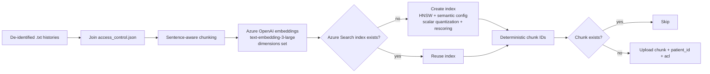
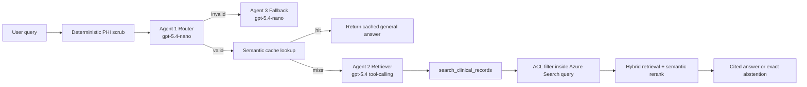
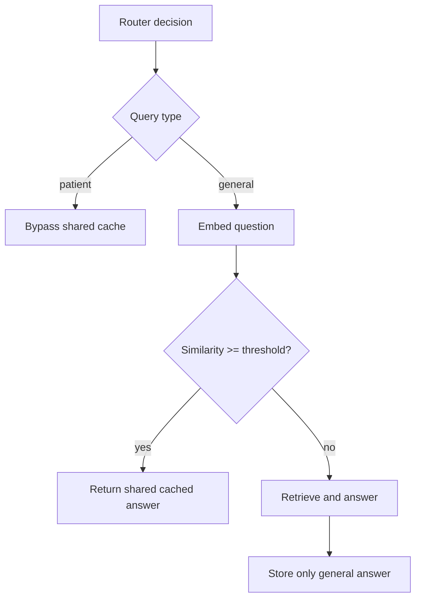

# Clinical RAG Production Prototype

This project is an Azure-backed clinical Retrieval-Augmented Generation application for de-identified patient histories. It provides deterministic ingestion, Azure AI Search hybrid retrieval with document-level ACL filtering, a three-agent Azure OpenAI answering flow, a conservative semantic cache, a Streamlit operator UI, and an evaluation harness using RAGAS and DeepEval.

## Architecture

### Ingestion Pipeline



### Multi-Agent Retrieval Pipeline



### Semantic Cache Decision



## Upload to Chat Flow

1. Configure Azure OpenAI and Azure AI Search environment variables in `.env`.
2. Start Streamlit.
3. In **Data / Ingestion**, click **Upload & Ingest**. The app reports documents found, per-document chunks, uploaded/skipped counts, and final index size.
4. In **Chatbot**, select an acting user. The UI keeps a separate chat history per user and does not display patient assignments until the user asks.
5. Ask access questions such as "Who are the patients under me?" or clinical-record questions such as "What medications are documented for this patient?" Access-list questions are answered from the Azure Search index using the acting user's ACL filter; clinical questions go through Azure Search and the agents.

## Setup

```bash
pip install -r requirements.txt
python -m spacy download en_core_web_lg   # optional; deid falls back to regex
cp .env.example .env
# Fill in Azure OpenAI and Azure AI Search values in .env.
streamlit run app/streamlit_app.py
```

CLI equivalents:

```bash
python -m src.ingest.pipeline
python -m eval.run_eval
python -m eval.build_golden
```

## Environment Variables

| Variable | Purpose | Default |
| --- | --- | --- |
| `AZURE_OPENAI_ENDPOINT` | Azure OpenAI endpoint | required |
| `AZURE_OPENAI_API_KEY` | Azure OpenAI key | required |
| `AZURE_OPENAI_API_VERSION` | Embedding API version | `2024-10-21` |
| `AZURE_OPENAI_CHAT_API_VERSION` | Chat API version | `AZURE_OPENAI_API_VERSION` |
| `AZURE_OPENAI_EMBED_DEPLOYMENT` | Embedding deployment | `text-embedding-3-large` |
| `AZURE_OPENAI_ROUTER_DEPLOYMENT` | Router deployment | `gpt-5.4-nano` |
| `AZURE_OPENAI_ANSWER_DEPLOYMENT` | Answer deployment | `gpt-5.4` |
| `AZURE_OPENAI_FALLBACK_DEPLOYMENT` | Fallback deployment | `gpt-5.4-nano` |
| `EMBED_DIMENSIONS` | Matryoshka embedding dimensions | `1024` |
| `MAX_OUTPUT_TOKENS` | Chat output budget | `700` |
| `OPENAI_CHAT_TOKEN_PARAM` | `auto`, `max_tokens`, or `max_completion_tokens` | `auto` |
| `AZURE_SEARCH_ENDPOINT` | Azure AI Search endpoint | required |
| `AZURE_SEARCH_API_KEY` | Azure AI Search admin/query key | required |
| `AZURE_SEARCH_INDEX_NAME` | Search index name | `clinical-kb` |
| `RETRIEVAL_TOP_K` | Vector candidates before rerank | `8` |
| `RERANK_TOP_N` | Semantic reranker output count | `5` |
| `RERANKER_SCORE_THRESHOLD` | Abstention confidence floor | `2.0` |
| `CACHE_SIMILARITY_THRESHOLD` | Tight semantic cache threshold | `0.94` |
| `CHUNK_SIZE_TOKENS` | Approximate chunk token budget | `500` |
| `CHUNK_OVERLAP_SENTENCES` | Whole-sentence overlap | `1` |
| `DATA_DIR` | Data directory | `data` |

## Design Decisions and Tradeoffs

- De-identification is deterministic and runs before routing, cache lookup, retrieval, or LLM calls. Presidio is used when available; regex fallback prevents app failure when the spaCy model is unavailable.
- Chunking is sentence-aware so clinical statements remain intact. Overlap is measured in complete sentences.
- Embeddings use `text-embedding-3-large` with the `dimensions` parameter for Matryoshka truncation, reducing storage and latency while keeping the model family stable.
- Azure AI Search semantic reranking is used instead of a separate reranker to keep retrieval inside the Azure boundary. The index config includes HNSW vector search and scalar quantization with original-vector rescoring when the installed SDK supports it.
- Model tiering keeps routing and fallback on a cheap deployment while the answer agent uses a capable deployment.
- The cache has two buckets by policy: general queries can be shared-cached with a tight threshold; patient-specific queries bypass the shared cache entirely.
- Every chunk carries `patient_id` and `acl`. The ACL predicate `acl/any(u: u eq '<user_id>')` is part of the Azure Search request before reranking, prompting, or caching.
- Questions about the acting user's assigned patients are answered deterministically from indexed ACL-filtered records rather than by the LLM.
- The answer agent uses tool-calling, but `user_id` is injected server-side. The model may choose search text, never the access principal.
- Raw PHI and raw vectors must not be logged.

## Evaluation Methodology

`eval/run_eval.py` runs the production pipeline for every reviewed golden item. Answerable items are scored with RAGAS retrieval metrics (`LLMContextPrecisionWithReference`, `LLMContextRecall`) and DeepEval agent metrics (`FaithfulnessMetric`, `AnswerRelevancyMetric`, custom `GEval` clinical correctness). Refusal items are checked deterministically, including unanswerable questions and ACL-negative questions where the user asks about a patient they cannot access.

`eval/build_golden.py` uses the DeepEval Synthesizer to generate answerable candidate questions from source documents with paraphrasing constraints, then merges the hand-authored `safety_core.jsonl`. Generated items are candidates and require clinician review before promotion to `qa_set.jsonl`.

The production report format is documented in `eval_results/sample_run.md`.

## Production and Scaling

- Use Azure Data Zone Standard deployments where compliance and latency boundaries require them.
- Choose Provisioned Throughput Units for predictable high-volume traffic; use pay-as-you-go for prototypes or variable workloads.
- Enable prompt caching where supported for stable system/tool prompts.
- Replace the in-process semantic cache with Azure Cache for Redis while preserving the same two-bucket policy.
- Use Entra ID and document-level ACLs as the production access-control source, then project authorized principals into the search ACL field at indexing time.
- Keep raw PHI out of application logs, telemetry payloads, cache keys, and evaluation traces.
